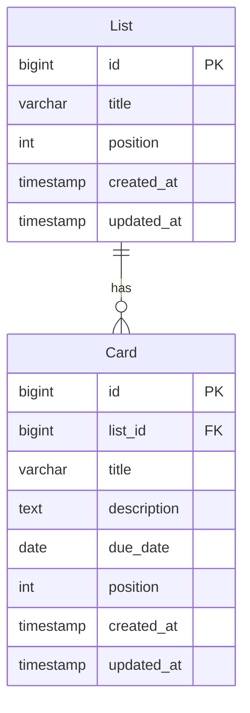

# データモデル

## テーブル定義

```
List
  id, title, position, created_at, updated_at

Card
  id, list_id, title, description, due_date, position, created_at, updated_at
```

---

## ER図


```mermaid
erDiagram
    List {
        bigint id PK
        varchar title
        int position
        timestamp created_at
        timestamp updated_at
    }
    Card {
        bigint id PK
        bigint list_id FK
        varchar title
        text description
        date due_date
        int position
        timestamp created_at
        timestamp updated_at
    }

    List ||--o{ Card : "has"
```
