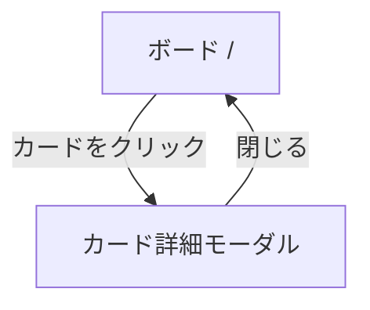
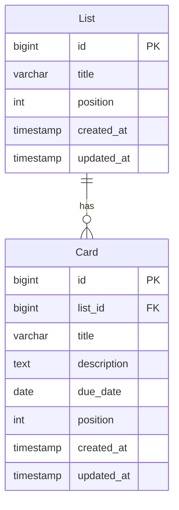

# 要件定義書：Trello風タスク管理アプリ

## 背景・目的
AIエンジニアコースの課題として、Trelloライクなタスク管理Webアプリを新規に構築する。
1つのボード上にリスト（カラム）を作成し、カード1枚1タスクでタスクを管理する。
ログイン機能は設けず、シングルユーザーとして動作するシンプルな構成とする。

---

## 1. システム概要

| 項目 | 内容 |
|------|------|
| アプリ種別 | Webアプリ（ブラウザ） |
| 認証 | なし（シングルユーザー） |
| ボード構成 | 固定の1ボード |
| データ永続化 | バックエンドAPI + データベース |

---

## 2. 技術スタック（推奨）

| レイヤー | 技術候補 |
|----------|----------|
| フロントエンド | Next.js (React) + TypeScript |
| スタイリング | Tailwind CSS |
| ドラッグ&ドロップ | @dnd-kit/core |
| バックエンド | Spring Boot (Java) |
| データベース | PostgreSQL |
| ORM | Spring Data JPA (Hibernate) |

---

## 3. 機能要件

### 3.1 リスト管理
- リストの作成・編集・削除
- リストの並び替え（ドラッグ&ドロップ）
- リスト内カード数の表示

### 3.2 カード管理
- カードの作成・編集・削除
- カードのリスト間移動（ドラッグ&ドロップ）
- カードの並び替え（ドラッグ&ドロップ）

### 3.3 カード詳細
- タイトル・説明文の編集
- 期限日の設定

---

## 4. 非機能要件

| 項目 | 内容 |
|------|------|
| レスポンシブ対応 | PC / タブレット対応（モバイルは任意） |
| パフォーマンス | ドラッグ操作が60fps相当でスムーズに動作 |
| UIテーマ | Trello風のシンプルかつ視認性の高いデザイン |

---

## 5. データモデル（概要）

```
List
  id, title, position, created_at, updated_at

Card
  id, list_id, title, description, due_date, position, created_at, updated_at
```

---

## 6. 画面一覧

| 画面名 | パス | 説明 |
|--------|------|------|
| ボード | / | リスト・カードの表示・操作メイン画面 |
| カード詳細 | （モーダル） | カード詳細の閲覧・編集 |

---

## 7. ユースケース

### アクター
- **ユーザー**（認証なし・シングルユーザー）

### UC-01 リスト管理
| ID | ユースケース | 説明 |
|----|-------------|------|
| UC-01-1 | リストを作成する | ボード上にリスト（カラム）を追加する |
| UC-01-2 | リストを編集する | リスト名を変更する |
| UC-01-3 | リストを削除する | リストと配下のカードをすべて削除する |
| UC-01-4 | リストを並び替える | ドラッグ&ドロップでリストの順序を変更する |

### UC-02 カード管理
| ID | ユースケース | 説明 |
|----|-------------|------|
| UC-02-1 | カードを作成する | リスト内にカードを新規追加する |
| UC-02-2 | カードを編集する | タイトル・説明・期限日を変更する |
| UC-02-3 | カードを削除する | カードを削除する |
| UC-02-4 | カードを並び替える | ドラッグ&ドロップで同一リスト内の順序を変更する |
| UC-02-5 | カードを別リストに移動する | ドラッグ&ドロップでカードを別リストに移動する |

---

## 8. 画面ワイヤーフレーム

### ボード画面 (`/`)

```
┌─────────────────────────────────────────────────────────────────┐
│  TaskBoard                                                       │
├─────────────────────────────────────────────────────────────────┤
│                                                                 │
│  ┌──────────────┐  ┌──────────────┐  ┌──────────────┐  [+]    │
│  │ 📋 ToDo  (3) │  │ ⚙️ 進行中 (2)│  │ ✅ 完了  (5) │         │
│  ├──────────────┤  ├──────────────┤  ├──────────────┤         │
│  │ ┌──────────┐ │  │ ┌──────────┐ │  │ ┌──────────┐ │         │
│  │ │ API設計  │ │  │ │ DB設計   │ │  │ │ 要件定義 │ │         │
│  │ │ 期限:5/20│ │  │ │ 期限:5/20│ │  │ │          │ │         │
│  │ └──────────┘ │  │ └──────────┘ │  │ └──────────┘ │         │
│  │ ┌──────────┐ │  │ ┌──────────┐ │  │ ┌──────────┐ │         │
│  │ │ UI実装   │ │  │ │ テスト   │ │  │ │ 画面設計 │ │         │
│  │ └──────────┘ │  │ └──────────┘ │  │ └──────────┘ │         │
│  │ ┌──────────┐ │  │              │  │              │         │
│  │ │ デプロイ │ │  │              │  │              │         │
│  │ └──────────┘ │  │              │  │              │         │
│  │ [+ カード追加]│  │ [+ カード追加]│  │ [+ カード追加]│         │
│  └──────────────┘  └──────────────┘  └──────────────┘         │
│                                                                 │
└─────────────────────────────────────────────────────────────────┘
```

### カード詳細モーダル

```
┌─────────────────────────────────────────────────────┐
│  API設計                                        [×] │
├─────────────────────────────────────────────────────┤
│                                                     │
│  📝 説明                                            │
│  ┌─────────────────────────────────────────────┐   │
│  │ REST APIのエンドポイント設計を行う。          │   │
│  │ OpenAPI仕様書も作成する。                    │   │
│  └─────────────────────────────────────────────┘   │
│                                                     │
│  📅 期限日                                          │
│  [ 2026-05-20 ]                                     │
│                                                     │
│                              [削除] [保存]          │
└─────────────────────────────────────────────────────┘
```

---

## 9. 画面遷移図



---

## 10. ER図



---

## 11. 開発フェーズ（推奨順）

1. **Phase 1** — プロジェクトセットアップ（Next.js フロントエンド + Spring Boot バックエンド + PostgreSQL）
2. **Phase 2** — リスト・カードのCRUD（REST API + UI）
3. **Phase 3** — ドラッグ&ドロップ（リスト並び替え・カード移動）
4. **Phase 4** — カード詳細（期限・説明文）
5. **Phase 5** — UIの仕上げ・レスポンシブ対応

---

## 12. 検証方法

- 各フェーズ完了後にブラウザで動作確認
- ドラッグ&ドロップ：カード・リストの移動がDB上に正しく反映されることを確認
- カード詳細：期限・説明文の保存・表示を確認
