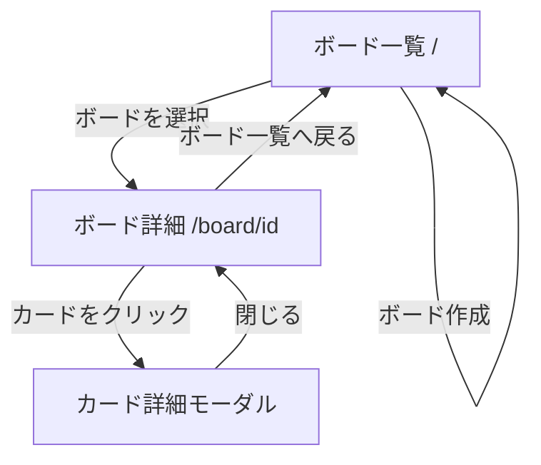
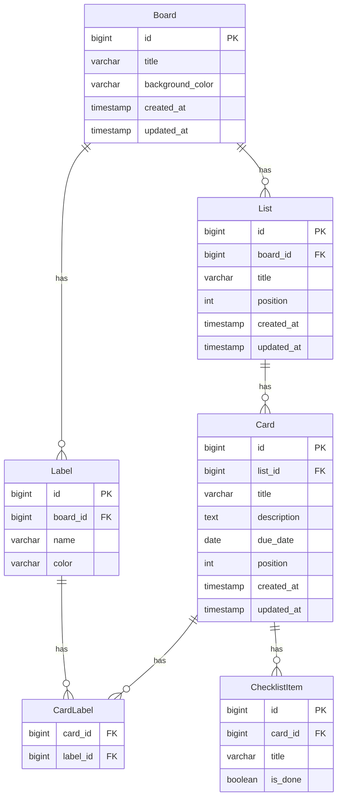

# 要件定義書：Trello風タスク管理アプリ

## 背景・目的
AIエンジニアコースの課題として、Trelloライクなタスク管理Webアプリを新規に構築する。
ユーザーがボード・リスト・カードの階層構造でタスクを管理でき、ドラッグ&ドロップやラベル機能を持つ。
ログイン機能は設けず、シングルユーザーとして動作するシンプルな構成とする。

---

## 1. システム概要

| 項目 | 内容 |
|------|------|
| アプリ種別 | Webアプリ（ブラウザ） |
| 認証 | なし（シングルユーザー） |
| データ永続化 | バックエンドAPI + データベース |

---

## 2. 技術スタック（推奨）

| レイヤー | 技術候補 |
|----------|----------|
| フロントエンド | Next.js (React) + TypeScript |
| スタイリング | Tailwind CSS |
| ドラッグ&ドロップ | @dnd-kit/core |
| バックエンド | Spring Boot (Java) |
| データベース | PostgreSQL |
| ORM | Spring Data JPA (Hibernate) |

---

## 3. 機能要件

### 3.1 ボード管理
- ボードの作成・編集・削除
- ボード一覧の表示
- ボードの背景色設定

### 3.2 リスト管理
- リストの作成・編集・削除
- リストの並び替え（ドラッグ&ドロップ）
- リスト内カード数の表示

### 3.3 カード管理
- カードの作成・編集・削除
- カードのリスト間移動（ドラッグ&ドロップ）
- カードの並び替え（ドラッグ&ドロップ）

### 3.4 カード詳細
- タイトル・説明文の編集
- 期限日の設定
- チェックリストの作成・管理
- ラベル（色付きタグ）の付与・管理

### 3.5 ラベル・タグ
- ラベルの作成（名前 + 色）
- カードへのラベル付与・解除
- ラベルによるフィルタリング（任意）

---

## 4. 非機能要件

| 項目 | 内容 |
|------|------|
| レスポンシブ対応 | PC / タブレット対応（モバイルは任意） |
| パフォーマンス | ドラッグ操作が60fps相当でスムーズに動作 |
| セキュリティ | 他ユーザーのデータへのアクセス禁止（認可チェック） |
| UIテーマ | Trello風のシンプルかつ視認性の高いデザイン |

---

## 5. データモデル（概要）

```
Board
  id, title, background_color, created_at, updated_at

List
  id, board_id, title, position, created_at, updated_at

Card
  id, list_id, title, description, due_date, position, created_at, updated_at

Label
  id, board_id, name, color

CardLabel
  card_id, label_id

ChecklistItem
  id, card_id, title, is_done
```

---

## 6. 画面一覧

| 画面名 | パス | 説明 |
|--------|------|------|
| ボード一覧 | / | ボード一覧 |
| ボード詳細 | /board/[id] | リスト・カードの表示・操作 |
| カード詳細 | （モーダル） | カード詳細の閲覧・編集 |

---

## 7. ユースケース

### アクター
- **ユーザー**（認証なし・シングルユーザー）

### UC-01 ボード管理
| ID | ユースケース | 説明 |
|----|-------------|------|
| UC-01-1 | ボードを作成する | タイトルと背景色を入力してボードを新規作成する |
| UC-01-2 | ボード一覧を見る | 作成済みのボードを一覧で確認する |
| UC-01-3 | ボードを編集する | ボードのタイトル・背景色を変更する |
| UC-01-4 | ボードを削除する | ボードと配下のリスト・カードをすべて削除する |

### UC-02 リスト管理
| ID | ユースケース | 説明 |
|----|-------------|------|
| UC-02-1 | リストを作成する | ボード上にリスト（カラム）を追加する |
| UC-02-2 | リストを編集する | リスト名を変更する |
| UC-02-3 | リストを削除する | リストと配下のカードをすべて削除する |
| UC-02-4 | リストを並び替える | ドラッグ&ドロップでリストの順序を変更する |

### UC-03 カード管理
| ID | ユースケース | 説明 |
|----|-------------|------|
| UC-03-1 | カードを作成する | リスト内にカードを新規追加する |
| UC-03-2 | カードを編集する | タイトル・説明・期限日を変更する |
| UC-03-3 | カードを削除する | カードを削除する |
| UC-03-4 | カードを並び替える | ドラッグ&ドロップで同一リスト内の順序を変更する |
| UC-03-5 | カードを別リストに移動する | ドラッグ&ドロップでカードを別リストに移動する |

### UC-04 カード詳細
| ID | ユースケース | 説明 |
|----|-------------|------|
| UC-04-1 | 期限日を設定する | カードに期限日を設定・変更・解除する |
| UC-04-2 | チェックリストを管理する | チェックリスト項目の追加・完了・削除を行う |
| UC-04-3 | ラベルを付与する | カードにラベルを追加・解除する |

### UC-05 ラベル管理
| ID | ユースケース | 説明 |
|----|-------------|------|
| UC-05-1 | ラベルを作成する | 名前と色を指定してラベルを作成する |
| UC-05-2 | ラベルを編集する | ラベルの名前・色を変更する |
| UC-05-3 | ラベルを削除する | ラベルを削除する（カードからも解除される） |

---

## 8. 画面ワイヤーフレーム

### ボード一覧画面 (`/`)

```
┌─────────────────────────────────────────────────────┐
│  TaskBoard                              [+ 新規作成] │
├─────────────────────────────────────────────────────┤
│                                                     │
│  ┌───────────┐  ┌───────────┐  ┌───────────┐       │
│  │ 🟦 開発   │  │ 🟩 デザイン│  │ 🟧 マーケ │       │
│  │           │  │           │  │           │       │
│  │ カード 5枚 │  │ カード 3枚 │  │ カード 8枚 │       │
│  └───────────┘  └───────────┘  └───────────┘       │
│                                                     │
└─────────────────────────────────────────────────────┘
```

### ボード詳細画面 (`/board/[id]`)

```
┌─────────────────────────────────────────────────────────────────┐
│  ← 開発ボード                                                    │
├─────────────────────────────────────────────────────────────────┤
│                                                                 │
│  ┌──────────────┐  ┌──────────────┐  ┌──────────────┐  [+]    │
│  │ 📋 ToDo  (3) │  │ ⚙️ 進行中 (2)│  │ ✅ 完了  (5) │         │
│  ├──────────────┤  ├──────────────┤  ├──────────────┤         │
│  │ ┌──────────┐ │  │ ┌──────────┐ │  │ ┌──────────┐ │         │
│  │ │ API設計  │ │  │ │ DB設計   │ │  │ │ 要件定義 │ │         │
│  │ │ 🔴 重要  │ │  │ │ 期限:5/20│ │  │ │          │ │         │
│  │ └──────────┘ │  │ └──────────┘ │  │ └──────────┘ │         │
│  │ ┌──────────┐ │  │ ┌──────────┐ │  │ ┌──────────┐ │         │
│  │ │ UI実装   │ │  │ │ テスト   │ │  │ │ 画面設計 │ │         │
│  │ └──────────┘ │  │ └──────────┘ │  │ └──────────┘ │         │
│  │ ┌──────────┐ │  │              │  │              │         │
│  │ │ デプロイ │ │  │              │  │              │         │
│  │ └──────────┘ │  │              │  │              │         │
│  │ [+ カード追加]│  │ [+ カード追加]│  │ [+ カード追加]│         │
│  └──────────────┘  └──────────────┘  └──────────────┘         │
│                                                                 │
└─────────────────────────────────────────────────────────────────┘
```

### カード詳細モーダル

```
┌─────────────────────────────────────────────────────┐
│  API設計                                        [×] │
├─────────────────────────────────────────────────────┤
│                                                     │
│  📝 説明                                            │
│  ┌─────────────────────────────────────────────┐   │
│  │ REST APIのエンドポイント設計を行う。          │   │
│  │ OpenAPI仕様書も作成する。                    │   │
│  └─────────────────────────────────────────────┘   │
│                                                     │
│  🏷️ ラベル                                          │
│  [🔴 重要] [🔵 バックエンド] [+ ラベル追加]          │
│                                                     │
│  📅 期限日                                          │
│  [ 2026-05-20 ]                                     │
│                                                     │
│  ✅ チェックリスト                          0% ━━   │
│  ☐ エンドポイント一覧の整理                          │
│  ☐ リクエスト/レスポンス定義                         │
│  ☑ 認証方式の確認                                   │
│  [+ 項目を追加]                                     │
│                                                     │
│                              [削除] [保存]          │
└─────────────────────────────────────────────────────┘
```

---

## 9. 画面遷移図



---

## 10. ER図



---

## 11. 開発フェーズ（推奨順）

1. **Phase 1** — プロジェクトセットアップ（Next.js フロントエンド + Spring Boot バックエンド + PostgreSQL）
2. **Phase 2** — ボード・リスト・カードのCRUD（REST API + UI）
3. **Phase 3** — ドラッグ&ドロップ（リスト並び替え・カード移動）
4. **Phase 4** — カード詳細（期限・メモ・チェックリスト）
5. **Phase 5** — ラベル機能
6. **Phase 6** — UIの仕上げ・レスポンシブ対応

---

## 12. 検証方法

- 各フェーズ完了後にブラウザで動作確認
- ドラッグ&ドロップ：カード・リストの移動がDB上に正しく反映されることを確認
- カード詳細：期限・チェックリスト・ラベルの保存・表示を確認
