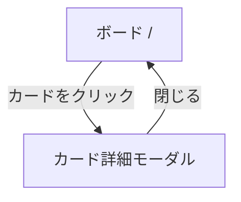

# 画面設計

## 画面一覧

| 画面名 | パス | 説明 |
|--------|------|------|
| ボード | / | リスト・カードの表示・操作メイン画面 |
| カード詳細 | （モーダル） | カード詳細の閲覧・編集 |

---

## ワイヤーフレーム

### ボード画面 (`/`)

```
┌─────────────────────────────────────────────────────────────────┐
│  TaskBoard                    [ 🔍 カードを検索... ]            │
├─────────────────────────────────────────────────────────────────┤
│                                                                 │
│  ┌──────────────┐  ┌──────────────┐  ┌──────────────┐  [+]    │
│  │ 📋 ToDo  (3) │  │ ⚙️ 進行中 (2)│  │ ✅ 完了  (5) │         │
│  ├──────────────┤  ├──────────────┤  ├──────────────┤         │
│  │ ┌──────────┐ │  │ ┌──────────┐ │  │ ┌──────────┐ │         │
│  │ │ API設計  │ │  │ │ DB設計   │ │  │ │ 要件定義 │ │         │
│  │ │ 期限:5/20│ │  │ │ 期限:5/20│ │  │ │          │ │         │
│  │ └──────────┘ │  │ └──────────┘ │  │ └──────────┘ │         │
│  │ ┌──────────┐ │  │ ┌──────────┐ │  │ ┌──────────┐ │         │
│  │ │ UI実装   │ │  │ │ テスト   │ │  │ │ 画面設計 │ │         │
│  │ └──────────┘ │  │ └──────────┘ │  │ └──────────┘ │         │
│  │ ┌──────────┐ │  │              │  │              │         │
│  │ │ デプロイ │ │  │              │  │              │         │
│  │ └──────────┘ │  │              │  │              │         │
│  │ [+ カード追加]│  │ [+ カード追加]│  │ [+ カード追加]│         │
│  └──────────────┘  └──────────────┘  └──────────────┘         │
│                                                                 │
└─────────────────────────────────────────────────────────────────┘
```

### 検索結果画面（キーワード入力時）

```
┌─────────────────────────────────────────────────────────────────┐
│  TaskBoard                    [ 🔍 API         ]                │
├─────────────────────────────────────────────────────────────────┤
│                                                                 │
│  「API」の検索結果（2件）                                        │
│                                                                 │
│  ┌─────────────────────────────────────────────────────────┐   │
│  │ API設計         リスト: ToDo      期限: 2026-05-20      │   │
│  └─────────────────────────────────────────────────────────┘   │
│  ┌─────────────────────────────────────────────────────────┐   │
│  │ REST API実装    リスト: 進行中     期限: なし            │   │
│  └─────────────────────────────────────────────────────────┘   │
│                                                                 │
└─────────────────────────────────────────────────────────────────┘
```

### カード詳細モーダル

```
┌─────────────────────────────────────────────────────┐
│  API設計                                        [×] │
├─────────────────────────────────────────────────────┤
│                                                     │
│  📝 説明                                            │
│  ┌─────────────────────────────────────────────┐   │
│  │ REST APIのエンドポイント設計を行う。          │   │
│  │ OpenAPI仕様書も作成する。                    │   │
│  └─────────────────────────────────────────────┘   │
│                                                     │
│  📅 期限日                                          │
│  [ 2026-05-20 ]                                     │
│                                                     │
│                              [削除] [保存]          │
└─────────────────────────────────────────────────────┘
```

---

## 画面遷移図


